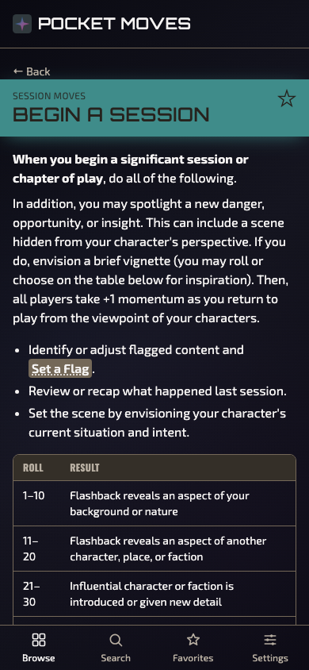
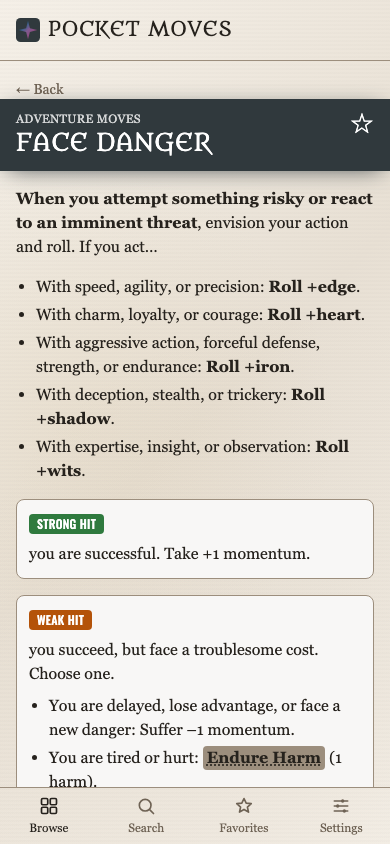
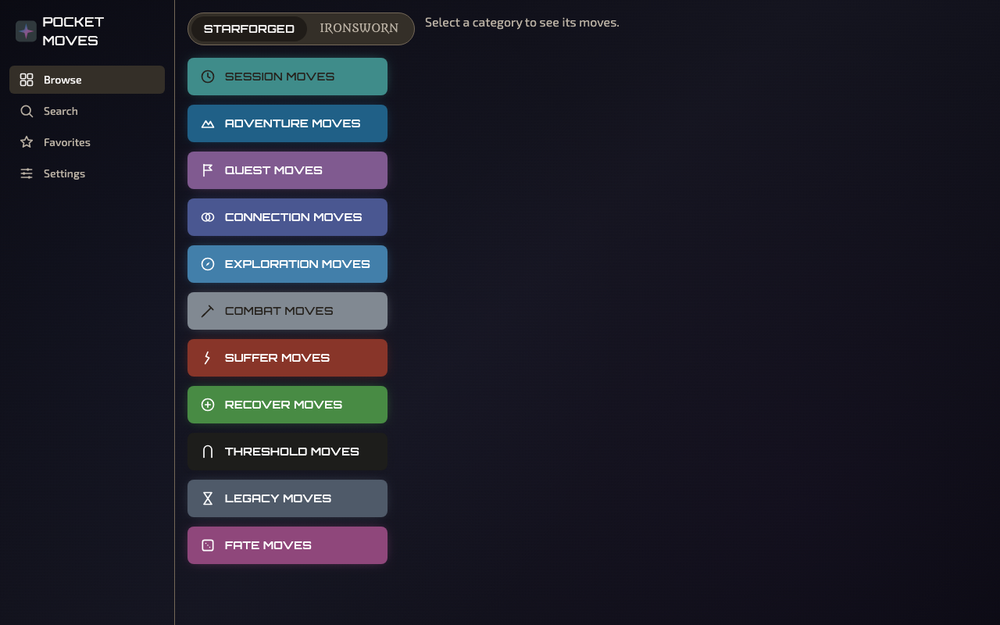

# Pocket Moves

A mobile-first pocket reference for the **Ironsworn** and **Starforged** tabletop RPGs — every move from both books, searchable and readable at a glance, installable as a PWA and fully offline after first load. Built for use *during play*, primarily on a phone.

**Live: https://sergiosjs.github.io/iron-moves/**

[](https://github.com/SergioSJS/iron-moves/actions/workflows/deploy.yml)

| Mobile (Starforged, dark) | Mobile (Ironsworn, light) | Desktop |
| --- | --- | --- |
|  |  |  |

## Features

- **Complete moves reference** — all 53 Ironsworn and 52 Starforged moves, extracted verbatim from the official PDFs, with triggers, roll options, Strong Hit / Weak Hit / Miss outcome blocks, tables and sidebars.
- **Action-roll dice roller** — 1d6+bonus vs 2d10 with Strong Hit / Weak Hit / Miss resolution, in two switchable styles: physics-based **3D dice** tumbling over the current screen (VTT-style, via `@3d-dice/dice-box`) or a lightweight **2D animation**. One tap from the tab bar, bonus stepper included.
- **Fast lookup** — fuzzy search (Fuse.js) across titles, triggers and outcome text, scoped per game or across both; or browse game → category → move in ≤3 taps.
- **Cross-referenced moves** — references like *Pay the Price* render as tappable links that open in a bottom sheet (mobile) or modal (desktop), so you never lose your place.
- **Favorites** — star frequently-used moves (Face Danger, Pay the Price…) for one-tap access; persisted in `localStorage`.
- **Per-game visual identity** — each book gets its own display font (Metamorphous / Orbitron), body font (Georgia / Exo 2), layered background and category colors taken from the books themselves, mirroring the companion oracle app [iron-oracle](https://sergiosjs.github.io/iron-oracle/).
- **Light & dark themes** — respects `prefers-color-scheme`, with manual override in Settings; WCAG-AA-checked contrast throughout.
- **Offline-first PWA** — installable, precaches everything; works with no signal.
- **Responsive** — bottom tab bar on mobile, sidebar + master-detail layouts at `md` and up.
- **i18n-ready** — UI strings via i18next (en populated, pt-BR stub); content pipeline is locale-namespaced so a translated rules text drops in without code changes.

## Tech stack

- **Vite + React 19 + TypeScript** (strict) — static SPA, no backend
- **Tailwind CSS** with a design-tokens theme (`src/styles/tokens.ts` is the single source of truth for color)
- **React Router** (hash router — GH-Pages-safe, shareable links)
- **Fuse.js** for client-side fuzzy search
- **i18next + react-i18next** for UI strings
- **vite-plugin-pwa** (Workbox) for offline caching and installability
- **Vitest + Testing Library** for unit tests, **Playwright** for a mobile-viewport e2e smoke test
- **pnpm** as package manager

## Getting started

Requires Node 22+ and pnpm 9.

```bash
pnpm i
pnpm dev          # local dev server
```

### Commands

| Command | What it does |
| --- | --- |
| `pnpm dev` | Dev server (regenerates content JSON first) |
| `pnpm build` | Production build → `dist/` |
| `pnpm preview` | Serve the production build locally |
| `pnpm typecheck` | `tsc -b` (strict, no `any`) |
| `pnpm lint` | ESLint |
| `pnpm test` | Vitest unit tests |
| `pnpm test:e2e` | Playwright mobile-viewport smoke test (builds + previews itself) |
| `pnpm format` | Prettier write |

`pnpm typecheck`, `lint`, `test` and `build` all run on every PR (`.github/workflows/ci.yml`) and must pass before merge.

## Project structure

```
├── content/                   # source-of-truth rules text (hand-curated, verbatim)
│   ├── ironsworn_moves.md
│   └── starforged_moves.md
├── docs/                      # original PDFs (reference only) + screenshots
├── scripts/
│   └── build-content.mjs      # content/*.md → src/data/<locale>/*.generated.json
├── src/
│   ├── app/                   # routing shell, layout, providers
│   ├── components/            # MoveCard, CategoryChip, OutcomeBlock, TabBar, …
│   ├── features/              # browse, move-detail, search, favorites, settings
│   ├── data/
│   │   ├── schema.ts          # TS types shared by content + UI
│   │   └── en/                # generated content JSON (gitignored, rebuilt every run)
│   ├── i18n/locales/          # en (populated) + pt-BR (stub) UI strings
│   └── styles/
│       ├── tokens.ts          # all colors (book-extracted tokens + WCAG math)
│       └── gameTheme.ts       # per-game fonts, backgrounds, scanlines
└── .github/workflows/         # ci.yml (PR gate) + deploy.yml (Pages)
```

## Content pipeline

The rules text in `content/*.md` is the human-readable source of truth — **never edit it to "fix" wording** without checking the source PDFs in `docs/` first; it's a faithful extraction.

`scripts/build-content.mjs` parses those files into typed JSON (`src/data/en/*.generated.json`, per `src/data/schema.ts`) and runs automatically before every `dev`/`build`/`typecheck`/`test`. The generated JSON is gitignored — fix the parser or the `.md`, never the JSON. Cross-referenced move names (`*Pay the Price*`) become tappable links via `{move:...}` tokens.

## Theming

- **`src/styles/tokens.ts`** — the only place book colors are defined: extracted ink/paper/accent tokens, Starforged's 11 category colors (Ironsworn is two-tone by design), and WCAG contrast math that derives the light/dark surface ramps and picks per-accent text colors.
- **`src/styles/gameTheme.ts`** — per-game personality mirroring [iron-oracle](https://sergiosjs.github.io/iron-oracle/): display font for titles, body font for content, layered per-game × light/dark backgrounds, and the horizontal scanline texture (a background layer on `body`/`.app-tabbar`, not an overlay).
- Wiring lives in `tailwind.config.ts` via the `data-current-game` attribute on `<html>`; dark variants use compound selectors (`.dark[data-current-game=...]`).

## Internationalization

UI strings ship in `en`, with a `pt-BR` stub wired so the Settings language switcher works today. Move content is locale-namespaced (`src/data/<locale>/`) with per-move fallback to `en` — when a pt-BR translation arrives, dropping in the two JSON files (or re-running `build-content.mjs` on translated markdown) is all it takes; no component changes needed.

## Deployment

Every push to `main` runs `.github/workflows/deploy.yml`: install → `pnpm build` with `VITE_BASE=/iron-moves/` → publish `dist/` via `actions/deploy-pages` to **https://sergiosjs.github.io/iron-moves/**.

There is no manual build-and-upload step, and `dist/` is never committed. Pages source is "GitHub Actions" (repo setting).

## Development conventions

This repo is built collaboratively by multiple AI coding agents across sessions — see **`SPEC.md`** (full product/technical spec) and **`AGENTS.md`** (quick-reference conventions, gotchas, and definition-of-done) before changing anything. In short: strict TS, no `any`, colors only from `tokens.ts`, one ticket per PR, CI green before merge.

## Credits

- **Ironsworn** and **Ironsworn: Starforged** are by **Shawn Tomkin** — the rules text extracted in `content/` comes from the official PDFs under their Creative Commons licenses. Get the books at [ironswornrpg.com](https://www.ironswornrpg.com/). This is an unofficial fan-made reference app.
- Visual theme inspired by this project's companion app, [iron-oracle](https://github.com/SergioSJS/iron-oracle) (oracle tables for the same games).
- Fonts: Metamorphous, Orbitron, Exo 2, Oswald (all OFL, self-hosted via Fontsource).
